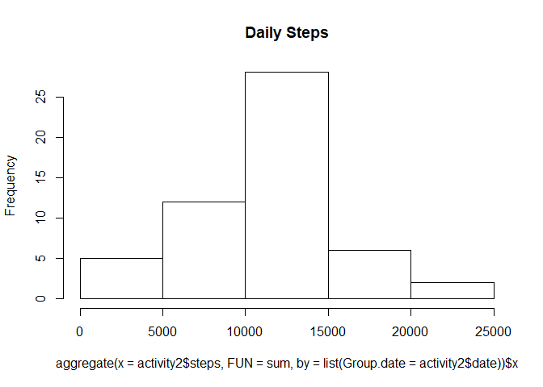
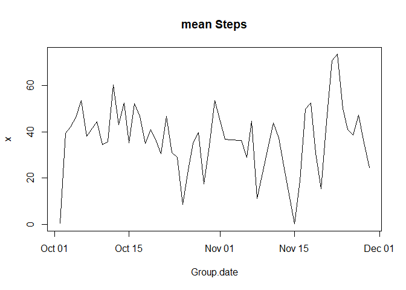
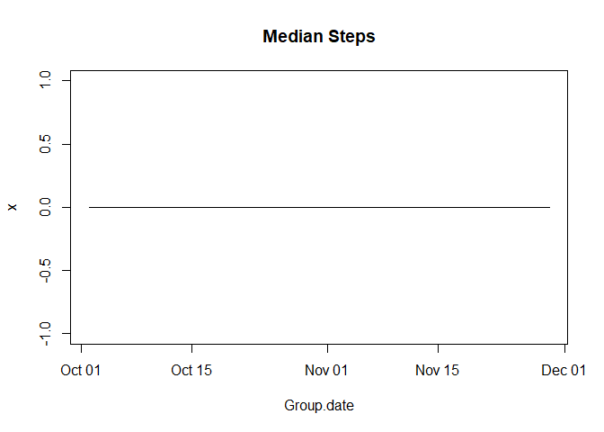
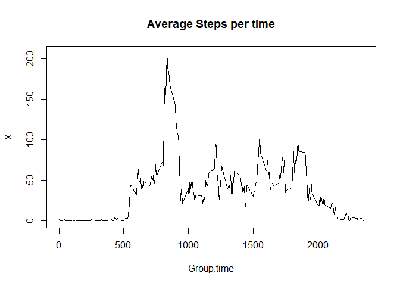
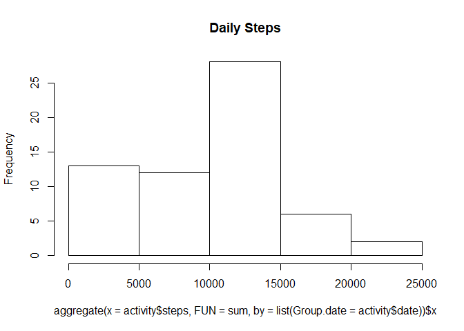
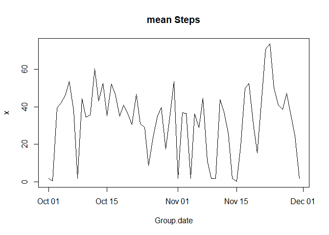
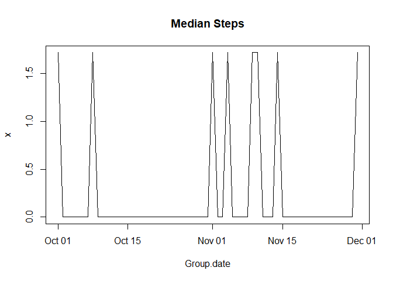
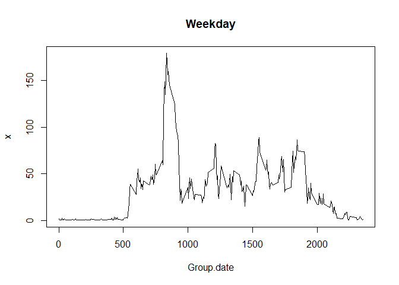
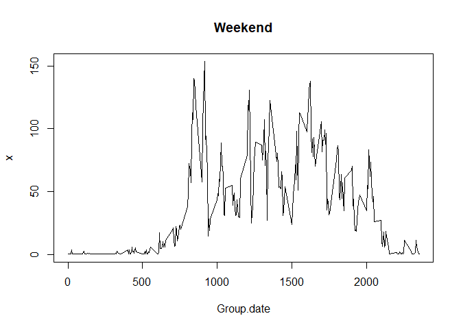

## Loading and preprocessing the data

```r
library("zoo")
```

```
## Warning: package 'zoo' was built under R version 3.4.4
```

```
## 
## Attaching package: 'zoo'
```

```
## The following objects are masked from 'package:base':
## 
##     as.Date, as.Date.numeric
```

```r
unzip("activity.zip")
activity <- read.csv("activity.csv", stringsAsFactors = FALSE)
activity$date <- as.Date(activity$date)
activity2 <- activity[complete.cases(activity), ]
```


## What is mean total number of steps taken per day?
Make a histogram of the total number of steps taken each day

```r
hist(aggregate(x = activity2$steps, FUN = sum, by = list(Group.date = activity2$date))$x, main = "Daily Steps")
```

<!-- -->
  
  Calculate and report the mean and median total number of steps taken per day


```r
plot(aggregate(x = activity2$steps, FUN = mean, by = list(Group.date = activity2$date)), main = "mean Steps", type = "l")
```

<!-- -->


```r
plot(aggregate(x = activity2$steps, FUN = median, by = list(Group.date = activity2$date)), main = "Median Steps", type = "l")
```

<!-- -->


## What is the average daily activity pattern?

```r
plot(aggregate(x = activity2$steps, FUN = mean, by = list(Group.time = activity2$interval)), main = "Average Steps per time", type = "l")
```

<!-- -->

```r
maxAvgSteps <- max(aggregate(x = activity2$steps, FUN = mean, by = list(Group.time = activity2$interval))$x)
print("Maxium average interval")
```

```
## [1] "Maxium average interval"
```

```r
print(subset(aggregate(x = activity2$steps, FUN = mean, by = list(Group.time = activity2$interval)), x == maxAvgSteps))
```

```
##     Group.time        x
## 104        835 206.1698
```


## Imputing missing values
  number of NA values

```r
sum(is.na(activity$steps))
```

```
## [1] 2304
```

  NAs will be replaced with average value for that time interval
  

```r
for(i in 1:ncol(activity)){
  activity[,i]=ifelse(is.na(activity[,i]),
                  mean(activity[activity$interval == activity[ i, "interval"], "steps"], na.rm = TRUE),
                  activity[,i])
}
activity$date <- as.Date(activity$date)
```

Make a histogram of the total number of steps taken each day

```r
hist(aggregate(x = activity$steps, FUN = sum, by = list(Group.date = activity$date))$x, main = "Daily Steps")
```

<!-- -->
  
  Calculate and report the mean and median total number of steps taken per day


```r
plot(aggregate(x = activity$steps, FUN = mean, by = list(Group.date = activity$date)), main = "mean Steps", type = "l")
```

<!-- -->


```r
plot(aggregate(x = activity$steps, FUN = median, by = list(Group.date = activity$date)), main = "Median Steps", type = "l")
```

<!-- -->
  
## Are there differences in activity patterns between weekdays and weekends?

```r
activity$weekend <- lapply(activity$date, weekdays)
activity$weekend <- as.factor(unlist(activity$weekend))

plot(aggregate(x = activity[-(activity$weekend == "Saturday" | activity$weekend == "Sunday") , ]$steps, FUN = mean, by = list(Group.date = activity[-(activity$weekend == "Saturday" | activity$weekend == "Sunday"), ]$interval)), main = "Weekday", type = "l")
```

<!-- -->

```r
plot(aggregate(x = activity[(activity$weekend == "Saturday" | activity$weekend == "Sunday") , ]$steps, FUN = mean, by = list(Group.date = activity[(activity$weekend == "Saturday" | activity$weekend == "Sunday"), ]$interval)), main = "Weekend", type = "l")
```

<!-- -->

